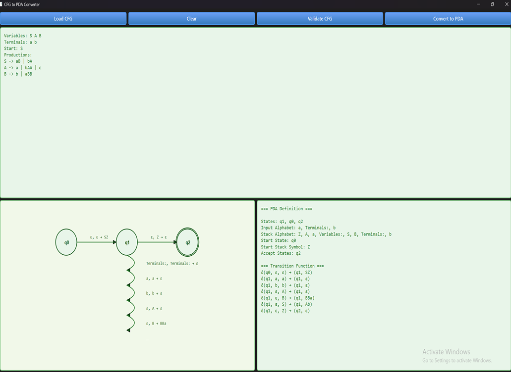

# CFG to PDA Converter

## Project Overview
The **CFG to PDA Converter** is a GUI-based application implemented in Qt/C++ that converts Context-Free Grammars (CFG) into their equivalent Pushdown Automata (PDA). This tool follows standard algorithms for CFG to PDA conversion and visually presents the resulting PDA for better understanding and educational purposes.

This project serves as an interactive educational aid in automata theory and compiler design, allowing users to input CFGs, validate them, and observe the corresponding PDA transitions and state diagrams.

## Key Features
- **CFG Parsing**: Supports grammar symbols including parentheses `( )`, alternation `|`, Kleene star `*`, and concatenation.
- **PDA Construction**: Implements ε-transitions, stack operations, and state transitions as per formal conversion methods.
- **GUI Visualization**: Displays PDA states and transitions clearly in both textual and graphical forms.
- **Educational Tool**: Helps users learn and understand automata theory concepts through hands-on interaction.
- **File Support**: Load CFG definitions from text files for convenience.

## System Architecture
- **CFG**: Stores grammar rules, variables, and terminals.
- **PDA**: Represents the automaton including states, transitions, and stack operations.
- **CFGParser**: Parses input CFG text into usable structures.
- **PDABuilder**: Implements the CFG to PDA conversion logic.
- **MainWindow**: Qt-based graphical interface for user interaction.


[Project Structure](images/Project_structure.png)

## How to Use
1. Input your CFG in the provided text box or load from a `.txt` file.
2. Click **Validate CFG** to check the grammar syntax.
3. Click **Convert to PDA** to perform the conversion.
4. View the PDA transitions in the list and see the PDA graphical visualization.
5. Use **Clear** to reset the input and output areas.

🖼️ GUI Preview
📌 CFG Input	➡️ CFG Validation & PDA Conversion	🔁 PDA Visualization

🎮 How the GUI Works
Write or Upload a CFG

Users can either type a full CFG (with variables, terminals, start symbol, and productions) directly into the text area or upload it via the Open File button.

Validate Syntax

The Validate CFG button checks if the CFG follows a correct structure and reports any issues for correction.

Convert to PDA

Once valid, clicking Convert to PDA builds the corresponding PDA using formal CFG-to-PDA transformation rules.

Visual Output

The resulting PDA is shown as:

A transition table (text format)

A graphical state diagram (if implemented with QGraphicsScene or similar)

Reset and Start Over

The Clear button resets both CFG and PDA views.

 



## Future Enhancements
- Support for additional grammar modifiers like `+` and `?`.
- Enhanced error handling with inline messages and syntax highlighting.
- Export PDA diagrams as images or structured files (JSON/XML).
- Add simulation mode to test strings against the PDA.
- Extend support for DFA/NFA conversions.
- Multi-platform deployment including mobile support.
- Interactive tutorials and quizzes for learning automata theory.


## Installation & Build Instructions
- Requires Qt framework and a C++ compiler.
- Clone the repository:
  ```bash
  git clone https://github.com/your-username/cfg-to-pda-converter.git
  cd 
  Afterwards Just open the .Pro File via QT and run the project


